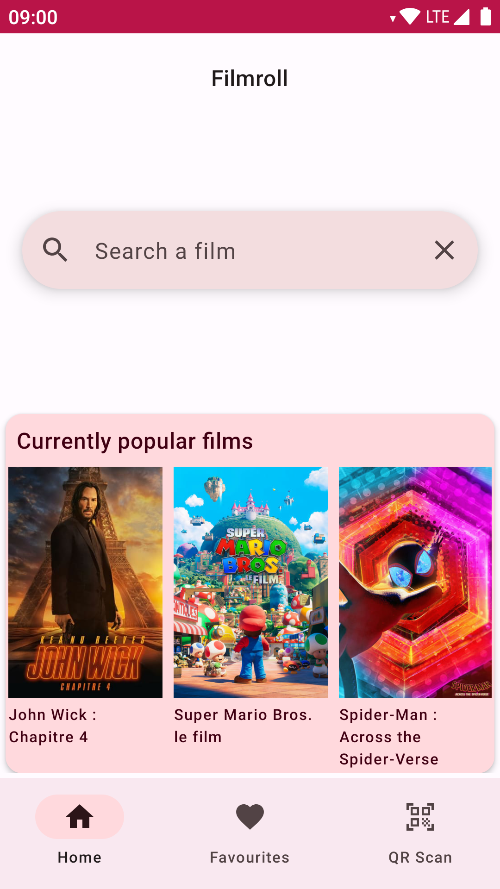

Filmroll
=========

An Android app to browse films.

The app uses the [Movie Database's API](https://developer.themoviedb.org/docs) to get
information about the films.



Features
---------

- Search for films
- Display a film's details
- List recommended films depending on the selected one
- Scan QR codes with a film's ID
- Set films as favourites

## Other features

- Nice colour theme
- Has an app icon
- View the favourites offline
- Material design 3
- See actor and crew list for a film
- UI translations (created: fr)
- Translated film results
- Handles network errors

Configuring
------------

Create the `gradle.properties` file in your user's `.gradle/` directory if it
doesn't exist, located for instance at `~/.gradle/gradle.properties`.

In this file, write the line
```gradle
TMDBApiToken="XXXX"
```
where `XXXX` is yout TMDB API token.

This allows to store the secret token out of the project, and not commit it.

Compiling the app
-----------------

Use the `gradlew` script corresponding to your operating system.

On Unix-likes, use the following command to compile the app:
```shell
./gradlew assemble
```

The APKs for the _debug_ and _release_ variants are located in their respective
directories under `app/build/outputs/apk`.

If instead you want to install the app directly on a phone, use the following
command:
```shell
./gradlew installRelease
```

Architecture
------------

The application internal architecture is structured according to the Android
recommendations.

```
                  ┌───────────┐
                  │           │
                  │   Logic   │
                  │           │
                  └─────┬─────┘
                        │
                 ┌──────▼──────┐
                 │             │
                 │  ViewModel  │
                 │             │
                 └──────┬──────┘
                        │
                 ┌──────▼─────┐
                 │            │
                 │ Repository │
                 │            │
                 └──────┬─────┘
                        │
                ┌───────┴───────┐
                │               │
         ┌──────▼─────┐    ┌────▼────┐
         │            │    │         │
         │  Database  │    │   API   │
         │            │    │         │
         └────────────┘    └─────────┘
```

License
-------

This project is distributed under the GPL v3 licence, or any later version. See the LICENCE file.

Some code comes from examples of the Android documentation, distributed under the Apache 2 licence.

The material icons use in the app are licensed under the Apache 2 licence as well.
